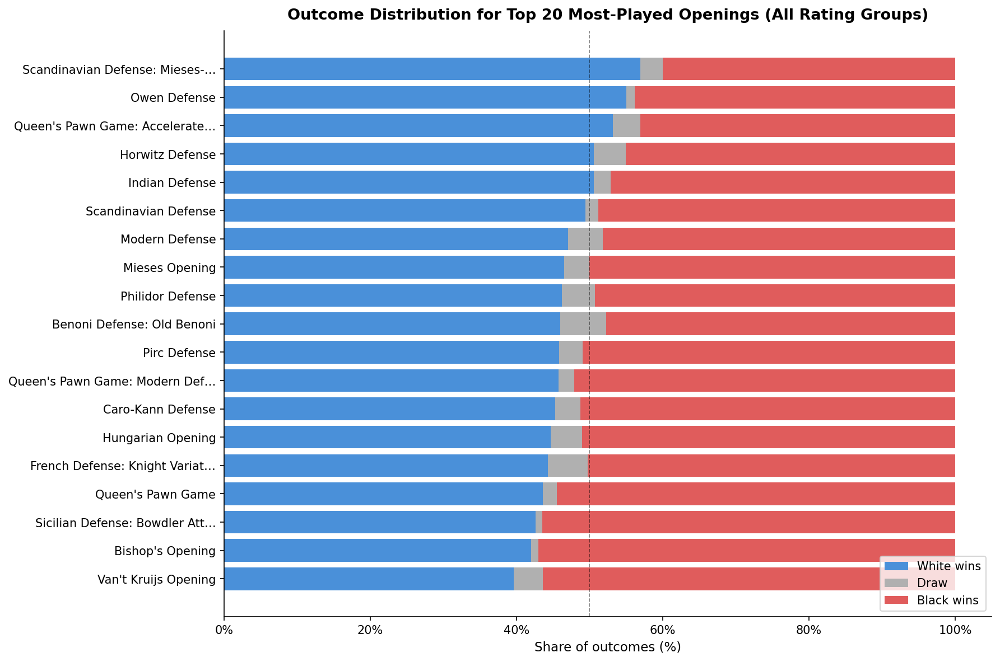
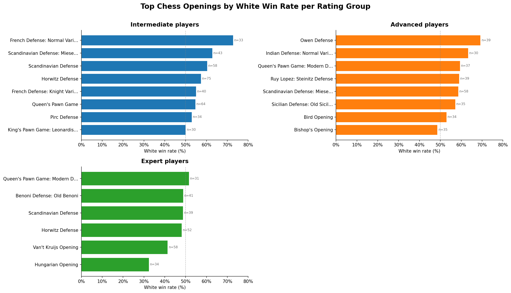
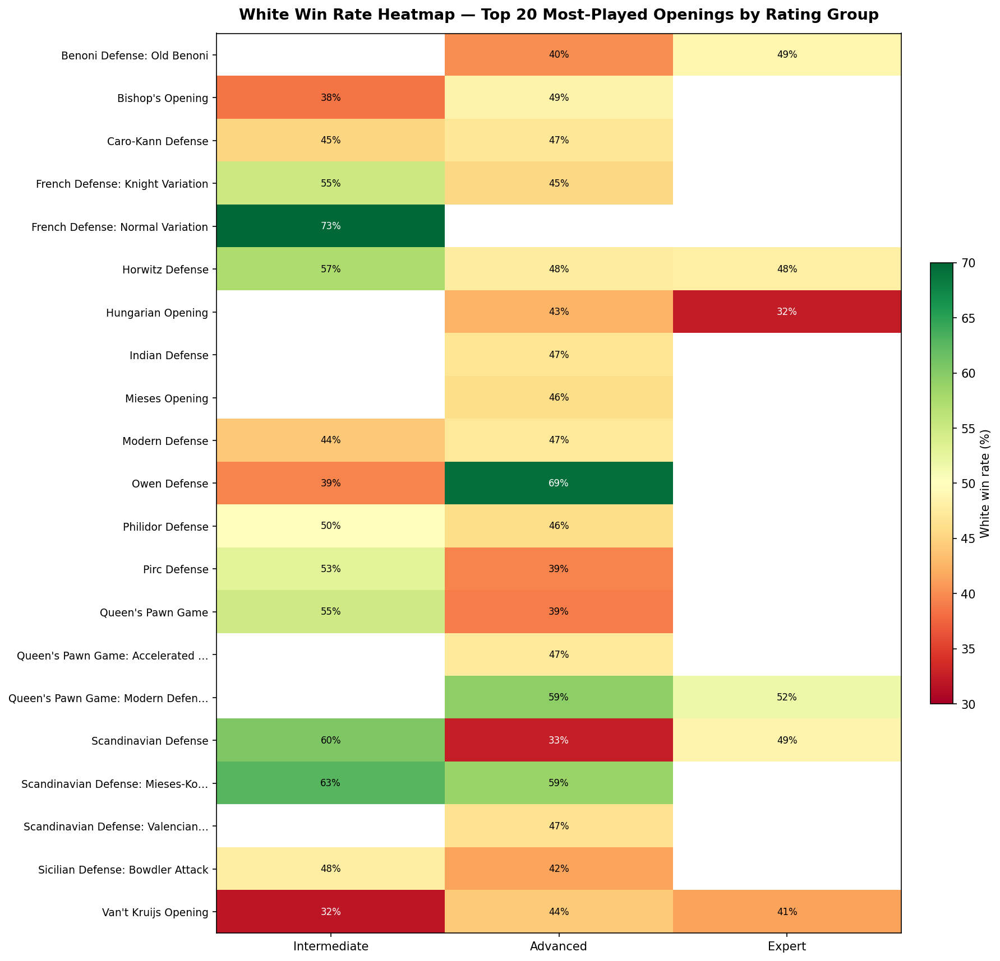
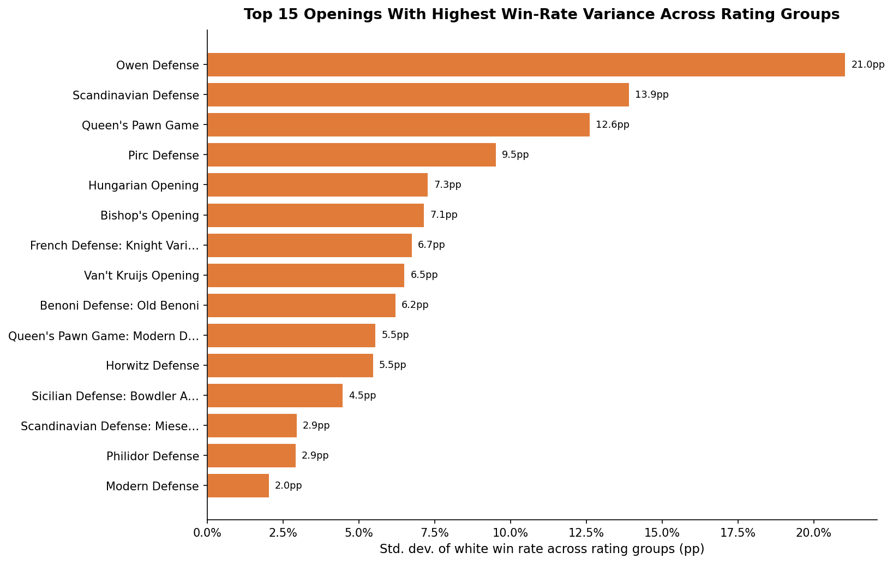
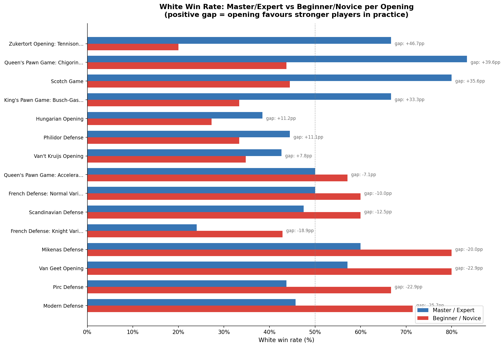
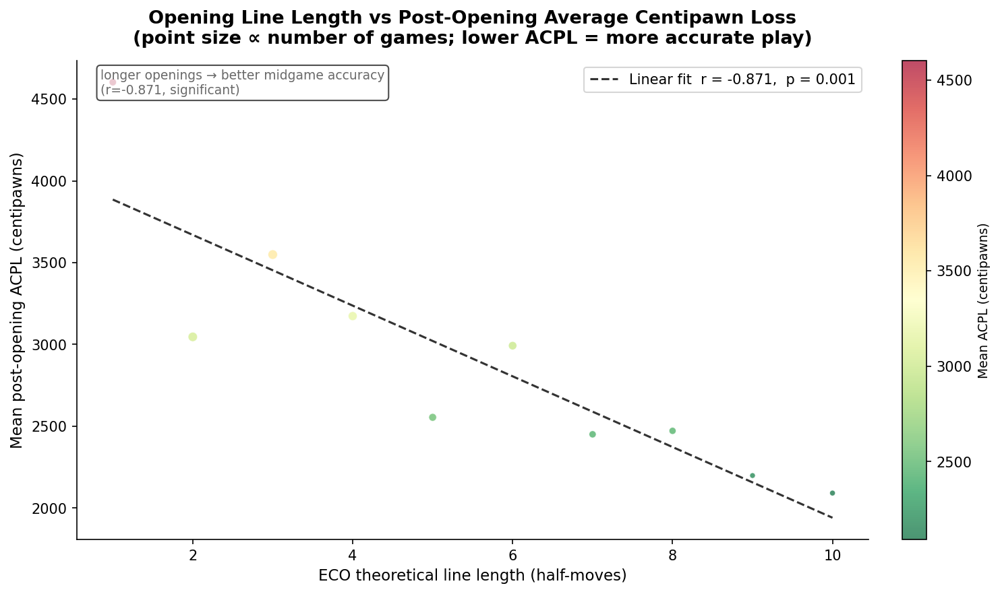

# Analyzing the Gap Between Chess Opening Theory and Practical Execution

## Contributors

- Yunsu Han
- Taeseok Kang

---

## Summary

The theory behind chess openings relies upon extended analysis performed by grandmasters, evaluations made by electronic engines, and experimentation by actual players in competition with each other through time. The theory utilizes the idea that the black pieces will have the advantage when both players play perfectly, and the white pieces will also have the same as long as both players play properly, and that the opening is still an equal opportunity for the two players. The data used to build this project is derived from regular people (i.e., amateurs), not from professional players, who frequently make mistakes; deviate from their prepared opening lines; and miscalculate their tactical ability.

To identify the differences between opening theory and how the openings are actually played by amateur and intermediate players, two separate data sets will be used: the Lichess Open Database and the Encyclopedia of Chess Openings (ECO). A fully automated end-to-end process has been put into place for this study, which will download the raw games, clean up and parse the PGN (portable Game Notation) f, match the PGN files against a standard EPC opening classification, and calculate the win percentage for the six rating groups that have been defined: beginners, novices, intermediates, advanced, experts, and masters. There will be two different data sets utilized; the Lichess Database and the Encyclopedia of Chess Openings (ECO).

The January 2017 Lichess dataset was the focus of our analysis. In this analysis we utilize a feature that is available in the data for the first time: engine evaluation annotations that are tagged as %eval (for engine eval). The use of this feature allows us to analyze win rates for different player levels based upon the openings played as well as to measure the accuracy of players after leaving the opening (post-opening) according to their Average Centipawn Loss (ACPL) in relationship to the length of the opening line played. Therefore, it will help with addressing our research question concerning the relationship between longer, more theoretical opening lines and overall poor mid-game performance when players have exited from their openings.

In our study of 10,000 chess games, we identified 84 legitimate openings with enough game counts to allow us to analyze reliably. We found that there are numerous significant differences in both white winning percentages for each opening (35% ≤ white wins and 72% ≥ white wins) and the way certain openings perform at various skill levels. The Owen Defense, in particular, has the largest variance in win rate across all groups (standard deviation = 21.0), indicating that players will have much different results by playing this opening based on their skill level as opposed to some sort of general expectation. In a separate analysis, we also found that there is a significantly negative correlation (r = -0.871, p = 0.001) between the length of ECO lines and ACPL after the opening phase. In other words, players who play longer (more theoretical) ECO lines show greater accuracy during the subsequent midgame than do players who play shorter (<3) ECO lines (the general assumption is that once players go beyond their preparation for ECO openings, they will 'fall off a cliff' in their play).

Based on our analysis of the collected data, it appears that theoretical evaluations do not yield accurate predictions of practical results for non-elite players, and that the empirical win rates should dictate the openings an amateur chess player chooses to play.

---

## Data Profile

### Dataset 1: Lichess Open Database

**Source:** [https://database.lichess.org](https://database.lichess.org)

**License:** Creative Commons CC0 (Public Domain). Lichess provides all of its game data for free and allows users to use, redistribute and modify at their discretion.

**Data format:** PGN (Portable Game Notation) compressed in Zstandard (extension is `.zst`). Every file corresponds to one month of rated standard games played on Lichess.

**Method of accessing data:** Programmatic HTTP download via `acquire_data.py`. Streams the `.zst` file into 8MB chunks and decompresses each chunk without loading the complete decompressed file into memory. Once decompressed, a SHA-256 checksum is calculated and saved alongside the decompressed file for integrity verification purposes.

**Data source:** The one-month period of January 2017 (`lichess_db_standard_rated_2017-01.pgn.zst`) was selected for use in Research Question 3 as it is the first month to contain evaluation information for per move black and white (`%eval`) so that the post-opening accuracy of both players can be assessed. There are no months that have evaluation information from earlier in the data set (e.g. before 2013).

**File Size:** The PGN file generated from decompression will be greater than 50MB in size therefore; there is insufficient space to store compressed PGN files through GitHub. Thus, the full-size decompressed PGN from January 2017 has been uploaded to Illinois Box, and can be accessed at the following link:

> **Box link:** *[Click here](https://uofi.box.com/s/zjrns6ghe7rsm33so5sx2wih6t2kj4k3)*
>
> Once downloaded, save the file to: `data/raw/lichess_2017-01.pgn`. Alternatively, follow the guideline in `run_all.py` to acquire the raw PGN dataset. 

**SHA-256 checksum:** `fb8800b...` (see `data/raw/lichess_2017-01.pgn.sha256`)

**Content:** Each game record contains structured PGN headers including `WhiteElo`, `BlackElo`, `Result`, `TimeControl`, and `Opening`, followed by the full move list. Moves after the opening phase include engine evaluation comments in the format `{ [%eval 0.23] }` or `{ [%eval #3] }` for forced-mate positions.

**Fields extracted:**
| Field | Description |
|---|---|
| `white_elo`, `black_elo` | Integer Elo ratings of both players |
| `result` | Outcome encoded as `white`, `black`, or `draw` |
| `time_control` | Time control string (e.g., `300+0`) |
| `opening_moves` | First ten half-moves extracted from board state |
| `num_opening_moves` | Actual number of opening moves played (≤10) |
| `post_opening_acpl` | Average centipawn loss per move after move 10 |

**Ethical and legal considerations:** The Lichess Database is published under a CC0 license, and there is no PII in the original Lichess data, including usernames (which we also do not store). There are no consent issues because all Lichess user data was voluntarily provided to the public and has been explicitly released by Lichess for use in research.

---

### Dataset 2: Encyclopedia of Chess Openings (ECO) Database

**Source:** [https://github.com/lichess-org/chess-openings](https://github.com/lichess-org/chess-openings)

**License:** Creative Commons CC0 (Public Domain).

**Format:** Five TSV files (`a.tsv` through `e.tsv`) with columns `eco`, `name`, and `pgn`.

**Method of accessing data:** A programmatic HTTP download of the five files using `integrate_data.py` and the `requests` library has been done. The files were downloaded and combined together into a single file located at `data/eco/eco_openings.csv`.

**Size:** 3,690 unique opening entries across all five volumes.

**Fields extracted and derived:**
| Field | Description |
|---|---|
| `eco_code` | ECO classification code (e.g., `B20`) |
| `opening_name` | Full name of the opening variation |
| `moves_clean` | Normalised move string used for prefix matching |
| `eco_line_length` | Number of half-moves in the theoretical line |

**Ethical and legal considerations:** This dataset does not contain any personally identifiable information and is licensed as CC0.

---

### Integration

The two datasets are merged in the file `integrate_data.py` using a longest-prefix matching method. Each game's `opening_moves` string will be compared against the normalized ECO move sequences based on the full 10 move prefixes first, and then shorter prefixes as needed. The use of the board state allows for proper handling of transpositions, as the moves are being taken from board state rather than PGN text.

In addition to adding the `eco_code`, `opening_name`, `eco_line_length`, `average_elo`, and `rating_group` to the game record, this merged dataset uses the average Elo to assign each game to one of six rating groups:

| Group | Elo Range |
|---|---|
| beginner | < 1000 |
| novice | 1000 – 1299 |
| intermediate | 1300 – 1599 |
| advanced | 1600 – 1899 |
| expert | 1900 – 2199 |
| master | ≥ 2200 |

All of the 10,000 cleaned games had a successful match with an ECO opening (100% match rate).

---

## Data Quality

The file `profile_data.py` completed an analysis of data quality and generated a complete report located at `results/lichess_2017-01/data_quality_report.txt`. 

**Completeness:** A total of 10,110 raw games were read, and of those 110 (1.1%) of the games were omitted due to missing Elo ratings or due to results that could not be recognised. The 10,000 game set used for analysis contained no missing values for the key data fields. The `post_opening_acpl` column represents an intentional sparsity, as of the 10,000 games only 1,146 (11.5%) contained eval annotated moves. Thus, it is a characteristic of the early 2017 dataset structure, not an indicator of data quality.

**Validity:** Elo ratings fit within the plausible range for Lichess (400-3500). All results fall within one of the three valid result categories. ECO line length is generally between 1 and 10 half moves (mean = 3.95, std = 2.19), which was expected.

**Consistency:** Transpositions that occurred during the extraction of moves based on the board state resulted in identical opening moves strings being extracted. 100% of the ECO matched to known theoretical lines verifying that all extracted sequences correspond to known theoretical lines.

**Distribution:** The distribution of players by rating groups is skewed toward intermediate and advanced chess players (intermediate = 2,802; advanced = 4,226) typical of the actual user base of Lichess. The distributions of players at the two extremes of the rating spectrum (beginning = 28; master = 340) are small, limiting the ability to obtain sufficient statistical power.

**Duplicates:** There were no duplicate rows contained within either the cleaned or integrated databases.

---

## Data Cleaning

The following preprocessing steps were performed on the raw PGN files we've collected before performing any analysis of the data in `clean_data.py`.

**Filter — Missing Elo ratings:** We removed any games that had either `WhiteElo` or `BlackElo` set to `"?"`, which were almost all of the 110 games we removed from the data. Most of the games we removed were between players who were not rated or were playing anonymously.

**Filter — Unrecognised results:** We removed any game that did not have a result of `1-0` (white wins), `0-1` (black wins), or `1/2-1/2` (draw). This included any game where the result was `*` (ongoing).

**Filter — Abandoned games:** We removed any game where there were fewer than five half-moves, since they would not provide any useful opening data.

**Extraction — Board-state-based move parsing:** Instead of extracting the actual opening moves as raw PGN text, we used the `python-chess` library to replay the game from the starting position and generate a SAN string for each move using the state of the board. This allows us to correctly handle transpositions — one of the significant problems we identified in our project plan and which this method solves.

**Extraction — Post-opening ACPL:** We used a regular expression that matches the Lichess engine evaluation comment format of `[%eval N]` to parse engine evaluation comments and to represent mate scores (i.e., `#N`) as ±1000 centipawns. We computed the loss in centipawns per move as the reduction in evaluation based on the perspective of the player making the move; however, we only included moves that were made after the first ten half-moves and required at least two evaluation comments after the opening in order to produce an evaluation.

**Result encoding:** We mapped the PGN result strings of `1-0`, `0-1`, and `1/2-1/2` to `white`, `black`, and `draw`, respectively.

---

## Findings

### Outcome Distribution Across Top Openings

Below is a chart that breaks down white wins, draws, and black wins based upon the 20 most commonly played openings in our dataset. The thick grey bars reflect that draws are quite uncommon to have in your games no matter which opening you are playing. The low level of play and blitzy game format of these games contribute to this. Most of the openings are also concentrated in the range of 40-55% for the white winning probability, with several exceptions to this.



---

### Top Openings by Rating Group

The following bar charts illustrate the white win rate for the best openings within each skill level category. Because both the beginner and master categories had a limited number of games played (28 for beginners and 340 for masters), they were excluded from this analysis; therefore, only the intermediate, advanced, and expert levels are shown.

Within the intermediate skill level, the French Defense: Normal Variation has the highest percentage of wins with a white win rate of 73% (using 33 games); furthermore, both the Scandinavian Defense: Mieses-Kotrč and the Horwitz Defence also performed well in terms of white win rates. The Owen Defence had an impressive white win percentage of 69% (based on 39 games) at the advanced level of play, while expert players showed less variation between openings with the Queen’s Pawn Game: Modern Defence at approximately 52% win percentage.



---

### White Win Rate Heatmap

The following heatmap illustrates win rates for 20 of the most popular openings among white pieces across different ratings and levels of play. Three strong patterns can be drawn from this data set:

- The **Owen Defense** has the most extreme skill-dependent variance within the data, dropping from 39% win rate at the Intermediate skill level to 69% win rate at the Advanced skill level.

- While the **French Defense: Normal Variation** has a 73% win rate at the Intermediate skill level, there is no data available regarding win rates for other skill levels (indicating that this opening is disproportionately popular at the Intermediate level).

- The **Scandinavian Defense** has an unusual "reversal" effect, with a 60% win rate at the Intermediate skill level, dropping to a 33% win rate at the Advanced skill level, before recovering to a 49% win rate at the Expert skill level (indicating performance differences related to progression along the skill continuum).



---

### Cross-Group Variance — Theory vs Practice Gap

The chart below presents, among 15 openings with the greatest variation in white’s win rate by rating group, the extent to which each opening’s practical performance supports its theoretical performance.

The **Owen Defense** has the highest level of variability of all at 21.0pp, which means an enormous divergence in the practical outcome of this opening based on who is playing it. Presenting next on this list is the **Scandinavian Defense** with 13.9pp and the **Queen’s Pawn Game** with 12.6pp.
At the opposite end of the rankings are the **Modern Defense** (2.0pp) and **Philidor Defense** (2.9pp), which have produced very consistent results across all groups, indicating that both of these openings create reliable outcomes regardless of player capabilities.



---

### Master vs Beginner Comparison

The graph below answers the first research question: Is there a disadvantage to the use of strong opening positions (i.e., logical for play) by inexperienced or novice players? 

The answer depends on which opening is used. For example, many games have large positive differences from the expert (master) player to the novice (beginner) player, indicating that the master or stronger players will typically do significantly better than their novice or weaker competitors with respect to the strong openings they use — such as the **Zukertort Opening**: **Tennison Gambit** (+46.7pp), **Queen's Pawn Game: Chigorin** (+39.6pp), and **Scotch Game** (+35.6pp).

However, there are also many openings where there are large negative differences, with the novice (beginner) player typically achieving a higher success rate than the expert (master) player when using those same openings (e.g., **Modern Defense**: −25.7pp; **Pirc Defense**: −22.9pp; **Van Geet Opening**: −22.9pp; **Mikenas Defense**: −20.0pp); therefore, this is a surprising finding, as it suggests that either those openings have greater randomness or that, due to the "chaotic"/imperfect position created by the openings, the novice players have the advantage over the expert players.



---

### Opening Line Length vs Post-Opening Accuracy

The scatter plot shown below analyzes the relationship between an opening's theoretical depth and the degree to which players' performance has changed after transitioning away from that zone of preparation.

The evidence shows a very strong evidence of a **negative correlation** between ECO line length and mean post-opening ACPL (r = -0.871, p = 0.001). What this indicates is that players who utilize longer, more theoretical openings perform better on average in the midgame due to a lower average centipawn loss than those who use shorter, less theoretical openings. In this case, the opposite is true as it relates to the assumption that memorizing long lines would subsequently lead to a player's confusion when they are out of theory.

Thus one likely to reason this is that players "who" choose to use longer theoretical openings are generally better prepared overall and are of a higher caliber than those who play shorter openings; therefore, the ECO line length would serve as an indirect indicator of a player's level of knowledge regarding theory and study.



---

## Future Work

Sample size is perhaps the largest limitation on the analysis performed. In the analysis performed with 10,000 games from one month (January 2017), the beginner bracket (28 games) and master bracket (340 games) ratings are both small relative to the total number of games therefore robust analysis cannot be performed with respect to ratings across openings on a per opening basis for both casual and advanced players. Using data from multiple months would provide a larger representation of the extremes of each of these groups and would allow for more reliable comparisons between android and advanced players.

The 11.5% eval annotation for the month of January 2017 creates a limitation in terms of the number of games included in the Q3 analysis. The Q3 analysis only includes 1,146 games included from 10 different line lengths. By utilizing a later month (2020 and beyond) from which Lichess added eval annotations to significantly more games, a larger and more reliable set of games can be used for the ACPL dataset and the Q3 analysis can be stratified or separated by rating group rather than pooled.

Lastly, although time control was collected as part of the dataset, it was not used as a control variable. Faster time controls tend to produce more errors and thus higher ACPL scores which may bias the opening length to accuracy analysis. Therefore, future analyses should separate the data or stratify by time control.

A position-matching method based on FEN (rather than prefix-matching using move strings) would potentially allow matching to occur even if there is transposition with moves that do not belong to any ECO line and could increase the occurrence rate of match transpositions for more unusual patterns of translation using ECO. 

Ultimately, should we increase the outcome measurement of chess by measuring not just the white win ratio to draw or black win ratios; increase accuracy values (acpl) between white and black in order to give a fair judgment based on other than win data that reflects the performance of an opening?

---

## Challenges

**Large file sizes and memory management.** The size of the Monthly Lichess PGN archive from 2017 will be several gigabytes once decompressed. In order to overcome this problem, we implemented streaming decomposition from within the `acquire_data.py` script using the `zstandard` library, as well as game-by-game parsing of PGN data using `python-chess` from within `clean_data.py`, so at any time only one game is stored in memory.

**Transposition handling.** In chess, it is possible for different sequences of moves to lead to the same board position. We accomplished this by using `python-chess` to retrieve all the moves for each board position directly rather than using the raw PGN text, which ensures that the same moves will yield the same opening string when there are transpositions, allowing them to be assigned to the same ECO entry.

**Snakemake installation on Windows.** It is not possible to install Snakemake in the Windows virtual environment because of build failures for C-extension dependencies (`immutables`, `datrie`). Thus, we wrote a `run_all.py` workflow script, written in Python, that combines all five pipeline steps into a single process with error handling and logging.

**Sparse eval annotations.** The January 2017 dataset includes only 11.5% of games that include some type of engine evaluation annotations; this level of annotation was not anticipated as part of the project plan, and therefore, we must recommend that future datasets should be considered as a basis for this project.

**ECO cache invalidation.** The addition of the `eco_line_length` column in the `integrate_data.py` file resulted in a `KeyError` because the cached file `eco_openings.csv` was created using an earlier version of the file. Therefore, we had to manually delete the cached version of the file before it could be re-downloaded – something that highlights the importance of having multiple versions of the cache available.

**Master vs beginner data sparsity.** The beginner rating group contained only 28 total games, which is less than the minimum number of games required for the primary analysis of 30. To remedy this shortage, the `master_vs_beginner` function was updated to use a lower per-group threshold of 5 games and operate directly on the raw dataframe rather than the pre-filtered `by_group` table.

---

## Reproducing

Follow the steps below to reproduce the project's pipeline from acquiring the data to producing the results.

**1. Clone the repository**
```bash
git clone https://github.com/yunsuhan0107/is477-project.git
cd is477-project
```

**2. Create and activate a virtual environment**
```bash
python -m venv venv

# Windows:
venv\Scripts\activate

# macOS/Linux:
source venv/bin/activate
```

**3. Install dependencies**
```bash
pip install -r requirements.txt
```

**4. Run the full pipeline**
```bash
python run_all.py --year 2017 --month 1 --max-games 10000
```

All five of these tasks can be accomplished with this one command:
- Step 1: Download and decompress PGN file from January, 2017, create a SHA-256 checksum of this file and store it in `data/raw/`
- Step 2: Clean, parse and separate out the first 10,000 games to store in `data/clean/`
- Step 3: Download ECO database, integrate it with all previously downloaded games and store in `data/integrated/`
- Step 4: Profile data quality and generate `data_quality_report.txt`, which will be saved in `results/lichess_2017-01/`
- Step 5: Apply all statistics to the data collected and generate charts and .csv summaries which will be saved in `results/lichess_2017-01/`

**5. Skip the download if the PGN already exists**
```bash
python run_all.py --year 2017 --month 1 --max-games 10000 --skip-acquire
```

**Requirements:** Python 3.12 or later is required for the `int | None` type union syntax used in the scripts.

---

## References

**Datasets:**

- Lichess. (2017). *Lichess Open Database — January 2017*. https://database.lichess.org. License: CC0.
- Lichess Organization. (2024). *chess-openings: ECO opening database*. GitHub. https://github.com/lichess-org/chess-openings. License: CC0.

**Software:**

- McKinney, W. et al. (2024). *pandas* (v2.x). https://pandas.pydata.org
- Fiekas, N. (2024). *python-chess* (v1.x). https://python-chess.readthedocs.io
- Hunter, J. D. (2007). Matplotlib: A 2D graphics environment. *Computing in Science & Engineering*, 9(3), 90–95. https://matplotlib.org
- Harris, C. R. et al. (2020). Array programming with NumPy. *Nature*, 585, 357–362. https://numpy.org
- Virtanen, P. et al. (2020). SciPy 1.0: Fundamental algorithms for scientific computing in Python. *Nature Methods*, 17, 261–272. https://scipy.org
- Gorny, S. (2024). *zstandard* Python bindings. https://github.com/indygreg/python-zstandard
- Da Costa-Luis, C. et al. (2024). *tqdm: A fast, extensible progress bar*. https://tqdm.github.io